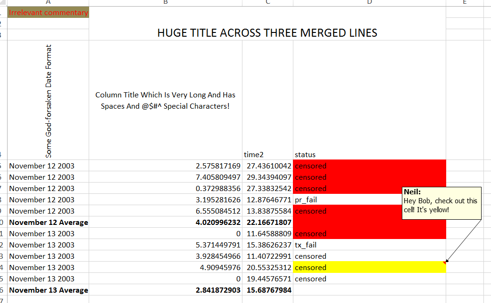

```{r setup, include=FALSE}
knitr::opts_chunk$set(echo = FALSE, cache=TRUE, fig.align = 'center', fig.height = 3, fig.asp=0.618)
options(tibble.width=70)
```

# admin

## contact, notes

|
-------------|---------------------------------------------------------------------
date format  | YYYY-MM-DD -- *All Hail ISO8601!!!*
instructor   | Neil Montgomery
email        | neilm@mie.utoronto.ca
office       | BA8137
office hours | W11-1
website      | portal (announcements, grades, suggested exercises, etc.)
github       | https://github.com/sta221-winter-2017 (lecture material, code, etc.)

## evaluation, book, tutorials

what | when | how much
-----|------|---------
midterm 1 | 2017-02-13 | 25%
midterm 2 | 2017-03-27 | 25%
exam | TBA | 50%

I will suggest exercises from the "required" book:

de Veaux, et al., 2014. *Stats: Data and Models*, Second Canadian Edition, 2 edition. ed. Pearson Canada.

Some suggested exercises will be worked out in tutorial each week, starting TBA.

Not a terrible book. I agree with most of it. Too many words. But covers what we need.

Any thick and comprehensive "Stats 101" book could also be a good resource.

## software 

Data analysis requires a computer. Also, some concepts can be illustrated using simulation, which also requires a computer. We will be using `R`. It's pretty good at data analysis. 

language | interpreter | integrated development environment
---------|-------------|-----------------------------------
`R`      | `R`         | `RStudio`

Some detailed instructions and suggestions for installation and configuration appear on the course website. I will try to impart some data analysis workflow wisdom throughout the course. Some already appears in the detailed instructions. 

I have signed up STA221 to have access to some optional R courses on the (well-regarded) datacamp.com training company. 

A higher level but thorough resource is:

Grolemund, G., Wickham, H., *R for Data Science* **available free at http://r4ds.had.co.nz/**


# pre-preliminaries---what is a dataset?

## most datasets are rectangles

Columns are the *variables*.

The top row has the names of the variables; possibly chosen wisely.

Rows are the *observations* of measurements taken on *units*.

There are no averages, no comments (unless in a "comment" variable), no colors, no formatting, no plots!

## not a dataset



## not a dataset


## an oil readings dataset (wide version)

```{r, message=FALSE}
library(tidyverse)
library(readxl)
oil <- read_excel("oil_readings.xlsx")
oil
```

## oil readings with `Ident` and `TakenBy` properly treated

```{r}
oil <- oil %>% mutate(Ident = factor(Ident), TakenBy = factor(TakenBy))
oil
```


## oil readings dataset (long version)

```{r}
oil_long <- oil %>% 
  gather(element, ppm, -Ident:-TakenBy)
oil_long
```

## a (simulated) "gas pipeline" dataset

```{r}
gas <- read_excel("pipeline.xlsx", col_types = rep("text", 4))
gas <- gas %>% 
  mutate(Leak=factor(Leak), Size=factor(Size, levels=c("1","1.5","1.75"), ordered=TRUE),
         Material=factor(Material), Pressure=factor(Pressure))
gas
```


## important questions

* where did the data come from?
    + were the units chosed randomly from a population?
    + were the units randomly assigned into groups?
* what are the (joint) *distributions* of the data?

## random sample, experiment, observational data

Sometimes the data come from a *random sample* from a larger *population*, in which case statements about the sample can apply to the population using laws of probability.

\pause (Not a focus of this course.)

\pause Sometimes data come from an *experiment* where units are randomly assigned to different *levels* of one or more *factors*, in which cause cause-and-effect can be inferred using laws of probability.

\pause Often the data are just some records of what happened. Grander inferences might be made, but only on a subject-matter basis.

## distribution (informally)

* A *distribution* is a 
    + Complete description of...
    + ...the possible values of one or more variables... 
    + ...and the relative frequency of those values.
    
* A dataset contains **empirical** information about distribution(s) that can be assessed
    + numerically
    + graphically  
    
* We can also consider probabily models for one or more variables or a relationship among variables. (Focus of this course.) 

# important concepts from probability

# independence

## independence - definition and example

Two *events* $A$ and $B$ are *independent* if:
$$P(A \cap B) = P(A)P(B),$$
(where $\cap$ means *and*.)

For example, roll a fair die. Let $A = \{1,2,3\}$ and $B=\{2,4\}.$ 

\pause $P(A) = 1/2$ and $P(B) = 1/3$, so $P(A)P(B)=1/6$.

\pause Also, $A \cap B = \{2\}$ so $P(A\cap B) = 1/6 = P(A)P(B)$

\pause Conclude: $A$ and $B$ are independent (short form: $A \perp B.$)

\pause Exercise: if $C = \{2,4,6\}$ then $B \perp C$ but $A \not{\!\perp} C$

## independence - comments

Independence is normally something that is *assumed* and not something that is demonstrated.

\pause Undisciplined use of language (e.g. "$A$ has nothing to do with $B$") is the leading cause of error. Use the definition.

\pause The opposite of independent is "not independent." (Avoid "dependent", which has misleading connotations.)

\pause $A \perp B \iff A \perp B^c \iff A^c \perp B \iff A^c \perp B^c$

# random variables and distributions

## concept of random variable

A *random variable* is a rule that assigns a number to any outcome of a random process. 

Example: "Roulette". There are 38 slots on a wheel coloured as follows:

Colour | \# of slots | Slot labels
-------|----|---------------------------------
Green  | 2  | 0, 00
Red    | 18 | 1, 3, 5, 7, 9, 12, 14, 16, 18, 19, 21, 23, 25, 27, 30, 32, 34, 36
Black  | 18 | 2, 4, 6, 8, 10, 11, 13, 15, 17, 20, 22, 24, 26, 28, 29, 31, 33, 35

## roulette - II 

If bet \$100 on "Red", then these are the possibilities:

Result | I receive 
-------|-----------
Red    | 200
Not Red | 0 

Stated another way, here is my net "gain", which I will call $X$, after the play:

Result | $X$
-------|-----
Red    | 100
Not Red| -100

## roulette - III

Technically the random variable is this the *rule*:

$$X(1) = X(3) = X(5) = \cdots = X(36) = 100$$
$$X(00) = X(0) = X(2) = \cdots = X(35) = -100$$

\pause But this is often a useless technicality. This is all we care about:

$x$ | $P(X=x)$
----:|---------
100 | 18/38
-100| 20/38

This table is the *distribution* of $X$, i.e. the possible outcomes and their probabilities.

## distribution and independence

The distribution of a random variable $X$ is, roughly, all information about the values of $X$ and their probabilities. 

\pause There's the odd (or maybe not?) fact that when $X$ is *continuously measured* then we have $P(X=x)=0$ for any particular $x$. In this case we're concerned with intervals of values and not particular values.

\pause $X$ and $Y$ can be independent when *knowing the outcome of $X$ does not change the distribution of $Y$ - a very strong statement (usually assumed when appropriate.)

## expected value

Random variables can have expected values (averages, means), variances, and standard deviations, that follow these rules:

\begin{align*}
\onslide<1->{E(aX + b) &= aE(X) + b\\}
\onslide<2->{E(X + Y) &= E(X) + E(Y)\\}
\onslide<3->{\text{Var}(aX+b) &= a^2\text{Var}(X)\\}
\onslide<4->{\text{Var}(X+Y) &= \text{Var}(X) + \text{Var}(Y) \text{ when } X \perp Y}
\end{align*}

## normal distributions and the central limit theorem

Normal distributions are an important family of symmetric, bell-shaped distributions, parametrized by mean $\mu$ and standard deviation $\sigma.$

\pause They are so widely used *in statistics* because the distribution of a sample average will be approximately normal if the sample size is "large enough". 

\pause "Large enough" is not fixed, but depends on the shape of the undelying population distribution, with more skewness requiring a larger sample size.

## normal approximation illustration through simulation - I 

I can simulate picking numbers uniformly at random between 0 and 1. 

Here are histograms of 1000, 10000, and 100000 picks:

```{r}
x1 <- data_frame(k=factor(c(rep(1000, 1000), rep(10000, 10000), rep(100000, 100000))),
                 x=runif(111000))
x1 %>% 
  ggplot(aes(x=x)) + geom_histogram(boundary = 0, bins=50) + facet_wrap(~k, scales="free") 
```

## normal approximation illustration through simulation - II 

I'll settle on $k=10000$ "replications" of my simulation.

My simulation will actually consist of:
* picking $n$ numbers uniformly at random
* calculating the average of those $n$ numbers
* doing this $k$ times
* making a histogram of the results.

I will choose $n$ to be 2, 10, and 50.

## normal approximation illustration through simulation - III

```{r}
k <- 10000
unif_means <- rbind(data_frame(n=2, means=apply(replicate(k, runif(2)), 2, mean)),
      data_frame(n=10, means=apply(replicate(k, runif(10)), 2, mean)),
      data_frame(n=50, means=apply(replicate(k, runif(50)), 2, mean))) %>% 
  mutate(n=factor(n))

unif_means %>% 
  ggplot(aes(x=means)) + geom_histogram(bins=50) + facet_wrap(~n, scales = "free")
  
```


## $t$ distributions

If a population is being modeled with a $N(\mu,\sigma)$ probability model and you are going to gather a sample $X_1,X_2,\ldots,X_n$, then the following are true:

\begin{align*}
\onslide<1->{\overline{X} &\sim N(\mu, \sigma/\sqrt{n})\\}
\onslide<2->{\frac{\overline{X} - \mu}{\sigma/\sqrt{n}} &\sim N(0,1) }
\end{align*}

\pause We usually don't know $\sigma$, but we can estimate it from the data using $s$, but then:
$$\frac{\overline{X} - \mu}{\sigma/\sqrt{n}} \sim t_{n-1}$$


